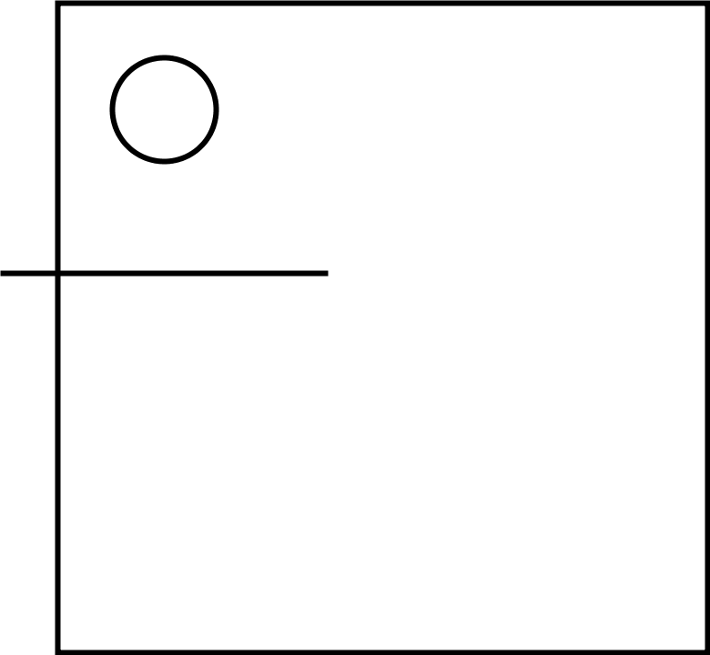

# Spreed it!

## Install

1. Install [rustup](https://rustup.rs) to get the latest rust toolchain.
2. Install [wasm-pack](https://rustwasm.github.io/wasm-pack/installer/)
3. Install nodejs and npm
4. In this directory run `wasm-pack build`
5. Navigate into the `www`-directory and run `npm install`
6. Start the local webserver using `npm run start`